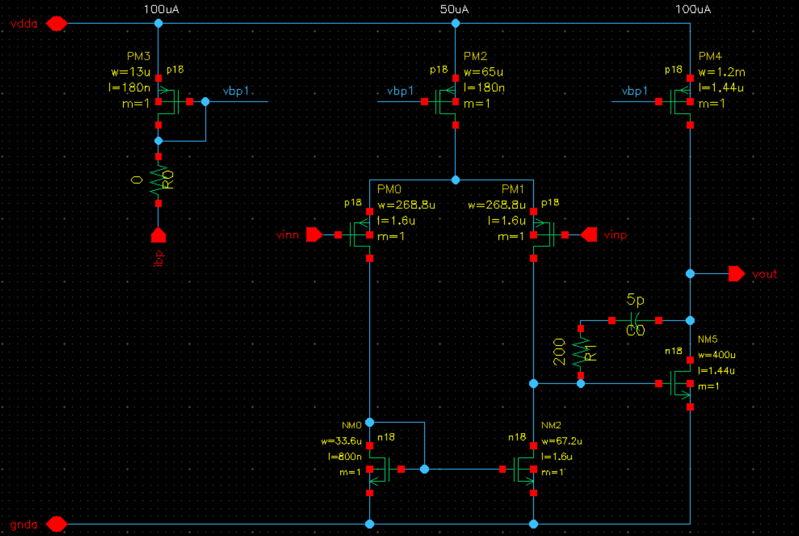
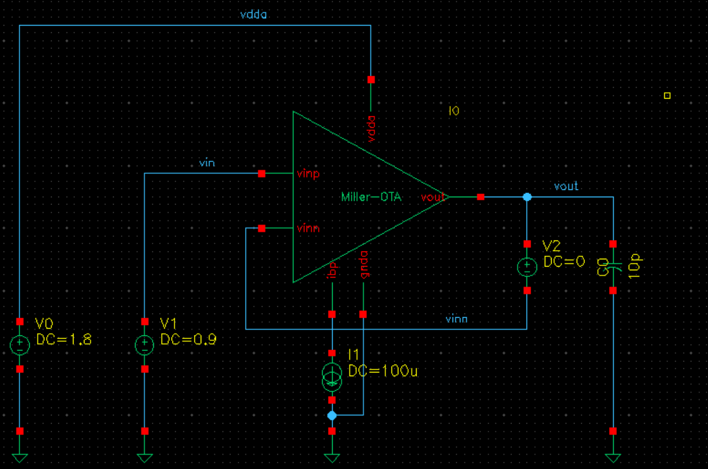

# AetherLab 

> The project is aimed to run aether simulation and record results automatically. 

## Supported Simulations
- `DC Analysis` \- calculate the power consumptions in DC state;
- `AC Analysis` \- run the AC analysis to get the **Frequency Response** of the amplifiers, including **GBW, PM**;
- `Noise Analysis` \- get the noise reports to estimate the noise performance of the systems, including **Input Noise, Output Noise**;
- `Area Counting` \- calculate the total area occupied of the systems;

## Branch TA202101
> modified version of the project for the **Teaching Assistor** in *2021/09 - 2022/01*

### Exam Questions
- According to the basic schematic design, the students need to calculate the size (W/L) of each transistors and set up the DC current.

- the OTA is a **two-order Miller OTA**, which is consisted of a normal P-type five-transistor-OTA and CS stage.

### Exam Requiremenets

1. PM larger than **60 degrees**
2. the DC gain is larger than **90dB**
3. the GBW is larger than **50MHz**
4. Power consumption **as small as possible**

> *ps. You are not expect to edit the testbench.*
 
## Branch TA2021-Final
> The final exam for under19.

### Q1 - Current Mirror

- Please design a current mirror to satisfy the following requirements:
    - Output current is 200 uA (error small than +/- 4 uA)
    - Bandwidth is larger than 100 MHz
    - DC output resistance is larger than 50k ohm
- **NOTE1:** you are not expected to edit the testbench, and could use the MDE setup directly.
- **NOTE2:** you are allowed to use maximum one ideal voltage source in your design.

### Q2 - Miller OTA
- Modify the dimension of the transistors inside Miller-OTA 'I0' to satisfy the following requirements:
    - PM larger than 60 degrees
    - the DC gain is larger than 60 dB
    - the GBW is larger than 50 MHz
    - Power consumption is less than 5 mW.
    - Total output noise is less than 50 uV.
- **NOTE**: You are not expected to edit the testbench, and you could use the MDE setup directly.